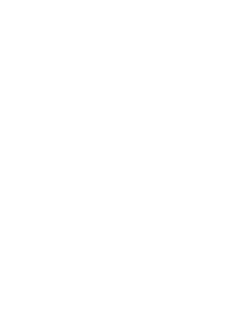

# Snoty.Me
An easy to use notification platform to connect services.
[https://snoty.me](https://snoty.me)

---

<!--
Hello, I'm Jakob, and this is my diploma thesis.
-->

<h5>Jakob Hofer</h5>
<a>https://github.com/SIMULATAN</a>

---

<!--
_class: lead
-->

<!--
You probably recognize most of these logos, most likely because you use them on a day-to-day basis. Going further, you probably also think that it's, frankly, quite difficult to keep track of all the things going on everywhere.
-->

## The Problem

    
    
    
    
    
    

---

<!--
_class: lead
-->

<!--
To solve this, I created Snoty!
-->

## The Solution: Snoty.Me

---

## If you want to...
- get notifications for assignments (e.g. Moodle -> Discord, ...)
- add exams to your calendar (e.g. Office365)
- search for a new car 👀 (e.g. willhaben.at)

... Snoty can help to solve your problems!

---

<!--
So, how does Snoty work?
Well, firstly, it is Node based. This means that functionality is encapsulated into "Nodes". To actually achieve something meaningful, Nodes are connected within a "Flow".

To illustrate this, the graphic is your Flow, the "Source", "Your custom logic" and "Target" boxes represent Nodes.

..and with "everything", I truly mean "all the things"!
Snoty is open source, therefore, everyone can add new functionality. A powerful, yet simple Framework makes it easy and it reduces boilerplate.
If something isn't supported, you can simply send a pull request and implement it yourself.
Or, if you can't wait or have a truly unique use case that wouldn't be merged into the main codebase, you can create your own Extension. By placing it in a specific folder, it'll be loaded at runtime.

-->

## Using Snoty
- Node based
    - 1 Node = 1 Action
    - Flow contains Nodes
- fetch from everything, send to everything!
- extend Snoty!
    - Pull Request
    - Extension

---

## Tech

<!--
Now, let's talk tech. Apart from the SaaS instance reachable on https://snoty.me, Snoty is fully open source and supports self-hosting.
The Backend is written in Kotlin and uses Ktor, JetBrains Exposed, JobRunr as well as other libraries.
As for the database, Postgres and MongoDB are supported, with H2 or SQLite support coming soon. Why both MongoDB and Postgres? Well, the former was chosen at first but dropped in favor of the SQL database as a multitude of weird issues kept occurring in production.
The Frontend is built using Svelte as the Framework with Skeleton and Tailwind providing opinionated UI components and styling utility classes respectively.
As for the Infrastructure used, the Backend runs in a self-hosted Kubernetes cluster. To authenticate users, the unfortunate decision to use Keycloak was made.
-->

<table>
    <tr>
        <td>Backend</td>
        <td>
            
            
            
            
        </td>
    </tr>
    <tr>
        <td>Frontend</td>
        <td>
            
            
            
        </td>
    </tr>
    <tr>
        <td>Infra</td>
        <td>
            
            
        </td>
    </tr>
</table>

---

<!--
_class: lead
-->

<!--
And with that, it's time for the demo!
-->

# Demo

---

## Thank you for listening.
Try Snoty now @ https://snoty.me
